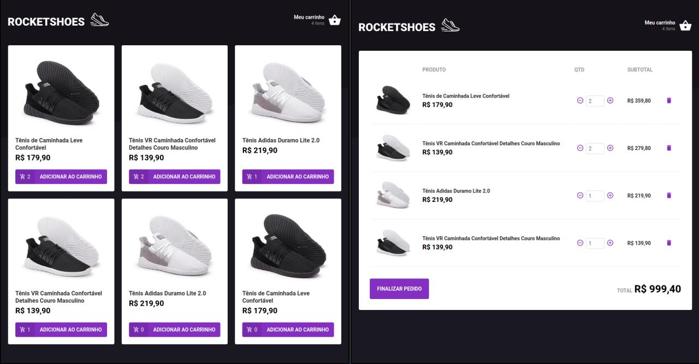

# Rocketshoes

A Rocketshoes é uma aplicação fictícia de venda de sapatos. A aplicação foi criada para demostrar o uso da arquitetura Flux. Através do uso do Redux e Redux Saga a aplicação controla o carrinho de compras. A arquitetura aplicada é responsável pela adição de uma compra ao carrinho e o cálculo dos valores apresentados.

**A versão mobile desse projeto pode ser encontrada nesse [link](https://github.com/jozieliosantiago/rocketshoes-mobile).**




## Instalação

Após clonar o repositório, dentro da pasta criada, execute o comando:

```bash
yarn
```

## Execução

Dentro da pasta do projeto execute:

```bash
yarn json-server -p 3333
```
*Na versão mobile um container docker foi criado para ser usado como server da aplicação. Um vez em execução o server poderá ser usado para ambas as aplicações. A explicação da execução do server pode ser encontrada no **README** da versão mobile nesse [link](https://github.com/jozieliosantiago/rocketshoes-mobile)*

Em outro terminal, ainda dentro da pasta do projeto, execute:

```bash
yarn start
```

## Licença
[MIT](https://choosealicense.com/licenses/mit/)
